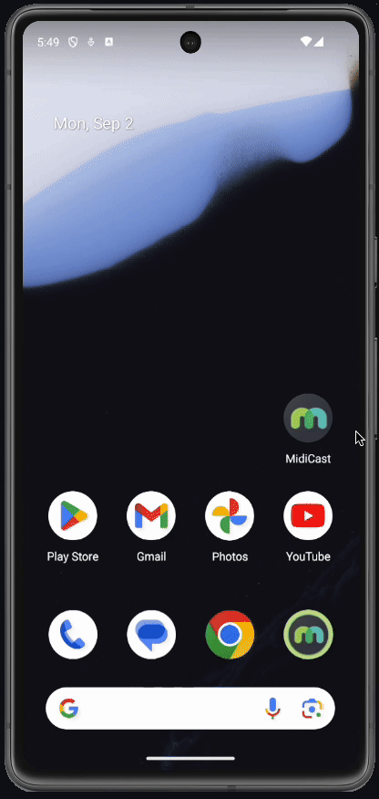
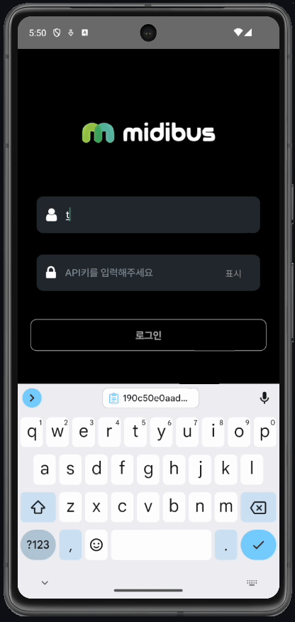
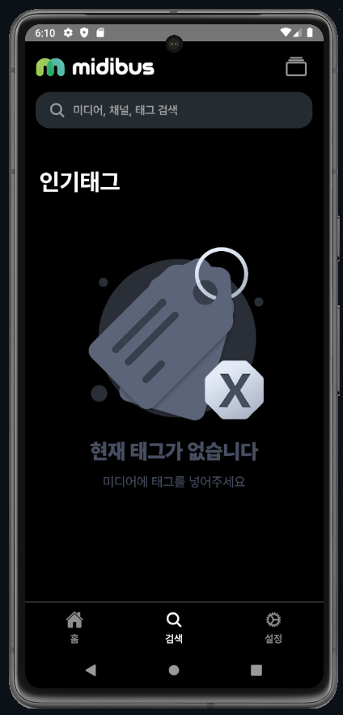
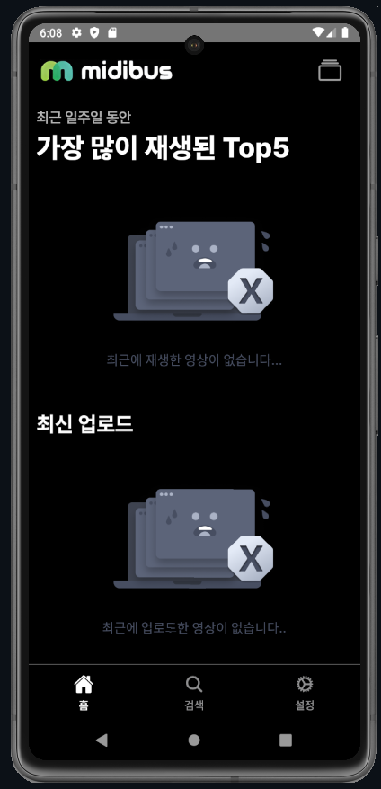
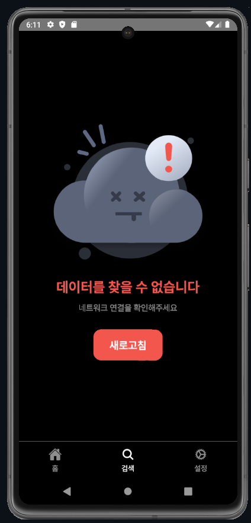
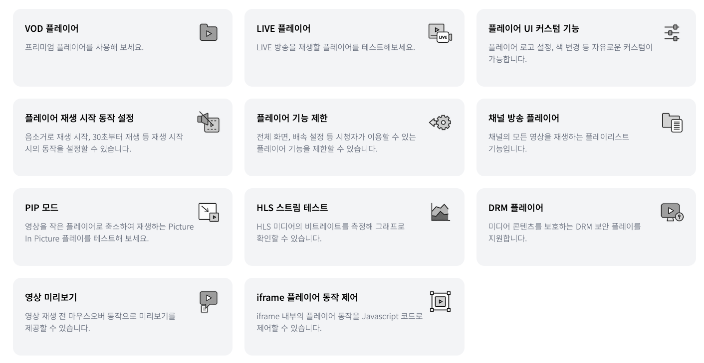
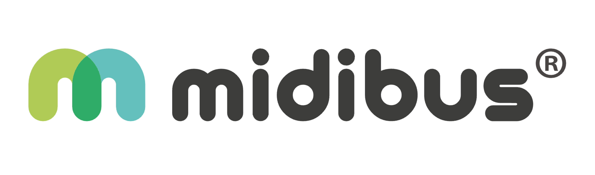

# MIdibus_SimpleOTT


<h2 align="center">simpeOTT : midibus API 기반 온라인 스트리밍 서비스</h2>

<div id="header" align="center">
  <div id="badges">
  <a href="https://www.linkedin.com/company/kinx/posts/?feedView=all">
    
  </a>
  <a href="https://www.kinx.net/">
    
  </a>
  <a href="https://www.facebook.com/KINXofficial/">
    
  </a>
  <a href="https://midibus.kinx.net/?utm_source=google&utm_medium=sa&utm_campaign=sa-mb-mb&utm_term=%EB%AF%B8%EB%94%94%EB%B2%84%EC%8A%A4&utm_content=biz&gad_source=1&gclid=CjwKCAjwxNW2BhAkEiwA24Cm9MH2SR8ilQjKBr-OQF6A-n_NIMkLNFH42xBm3YfW5QJZEpQqb9Lf_hoCWu4QAvD_BwE">
    
  </a>
  </div>
</div>
<br/>

[**SimpleOTT**](https://github.com/kinxcdn/midibus_simpleOTT)는 Midibus API와의
연동을 통해 누구나 손쉽게 자신만의 OTT(Over-The-Top) 서비스를 구축할 수 있도록설
계된 강력한 솔루션입니다. 이 도구를 사용하면, 복잡한 설정 없이도 비디오 스트리밍
플랫폼을 빠르게 시작할 수 있으며, 다양한 기능과 유연한 옵션을 통해 사용자의요구
에 맞는 맞춤형 OTT 서비스를 제공할 수 있습니다. SimpleOTT는 사용자가 콘텐츠를 관
리하고, 스트리밍 환경을 최적화하며, 사용자 경험을 향상시킬 수 있는 모든 필요한도
구를 제공합니다.

재생 위치에 따라 가장 가까운 CDN 엣지 서버에서 동영상을 전송하여 버퍼링 걱정 없
이 시청할 수 있습니다. 대규모 동영상 시청 트래픽이 걱정이라면, 미디버스를 사용해
보세요,
[**Midibus**](https://midibus.kinx.net/?utm_source=google&utm_medium=sa&utm_campaign=sa-mb-mb&utm_term=%EB%AF%B8%EB%94%94%EB%B2%84%EC%8A%A4&utm_content=biz&gad_source=1&gclid=CjwKCAjwxNW2BhAkEiwA24Cm9MH2SR8ilQjKBr-OQF6A-n_NIMkLNFH42xBm3YfW5QJZEpQqb9Lf_hoCWu4QAvD_BwE)는
VOD와 LIVE 서비스 구축에 필요한 기능을 모두 제공합니다. VOD/LIVE 스트리밍, 플레
이어, 미디어 서버 호스팅, 인코딩, 배포, 보안, 데이터 분석, CMS까지동영상 서비스
에 필요한 모든 기능을 미디버스 하나로 해결하세요.

> midibus에서 관리하는 동영상을 OTT 서비스로 원하는 고객들에게 콘텐츠를 제공하세
> 요!

## 시작하기

Get started with Midibus now!

- 🚀
  [지금 가입하고 30일간 무료로 미디버스의 성능을 확인하세요](https://midibus.kinxcdn.com/signup?_gl=1*1p655o*_gcl_aw*R0NMLjE3MjUzMjk2OTUuQ2p3S0NBand4TlcyQmhBa0Vpd0EyNENtOU1IMlNSOGlsUWpLQnItT1FGNkEtbl9OSU1rTE5GSDQyeEJtM1lmVzVRSlpFcFFxYjlMZl9ob0NXdTRRQXZEX0J3RQ..*_gcl_au*NDEyNTY4Nzk4LjE3MjMwOTg3NDY.*_ga*NTEwMjMyNzM1LjE3MjQxMTg5NTA.*_ga_YLN2CKQZ0R*MTcyNTMyOTY5NS44LjAuMTcyNTMyOTY5NS42MC4wLjA.)
- 📖
  [Read Midibus Docs](https://docs.midibus.kinxcdn.com/?_gl=1*ge7g5q*_gcl_aw*R0NMLjE3MjUzMjk2OTUuQ2p3S0NBand4TlcyQmhBa0Vpd0EyNENtOU1IMlNSOGlsUWpLQnItT1FGNkEtbl9OSU1rTE5GSDQyeEJtM1lmVzVRSlpFcFFxYjlMZl9ob0NXdTRRQXZEX0J3RQ..*_gcl_au*NDEyNTY4Nzk4LjE3MjMwOTg3NDY.*_ga*NTEwMjMyNzM1LjE3MjQxMTg5NTA.*_ga_YLN2CKQZ0R*MTcyNTMyOTY5NS44LjAuMTcyNTMyOTcwOC40Ny4wLjA.)
- 🏢 [서비스 사용 기업 살펴보기](https://midibus.kinx.net/#customers)

## ✅ Getting Started

> 안드로이드 스튜디오 또는 Xcode 시뮬레이션 환경 설정을 완료하세요

## Setup
- node 18.x를 설치하는 것을 권장합니다.
- react native로 제작된 앱으로 관련 설정이 필요합니다.
- 이 저장소를 복제합니다 Clone this repo:
  `git clone https://github.com/RocketChat/Rocket.Chat.git`

```bash
npm install
```

### 앱 실행

> **Note**
>
> API key는
> [미디버스](https://midibus.kinxcdn.com/signup?_gl=1*1p655o*_gcl_aw*R0NMLjE3MjUzMjk2OTUuQ2p3S0NBand4TlcyQmhBa0Vpd0EyNENtOU1IMlNSOGlsUWpLQnItT1FGNkEtbl9OSU1rTE5GSDQyeEJtM1lmVzVRSlpFcFFxYjlMZl9ob0NXdTRRQXZEX0J3RQ..*_gcl_au*NDEyNTY4Nzk4LjE3MjMwOTg3NDY.*_ga*NTEwMjMyNzM1LjE3MjQxMTg5NTA.*_ga_YLN2CKQZ0R*MTcyNTMyOTY5NS44LjAuMTcyNTMyOTY5NS42MC4wLjA.)
> 에서 무료체험을 통해 받으실 수 있습니다.

### android & ios

```bash
npm run android
```

or

```bash
npm run ios
```

## ✅ 기능 소개

### 스플래시

<table>    
    <tr align="center" > 
        <td><strong>스플래시</strong></td>
    </tr>
    <tr align="center"> 
        <td>  </td>
    </tr>
</table>

### 로그인

<table>    
    <tr align="center" > 
        <td><strong>로그인</strong></td>
    </tr>
    <tr align="center"> 
        <td>  </td>
    </tr>
    <tr> 
        <td>
            1. 미디버스에 apikey와 계정을 통해 로그인<br>
        </td>
</table>

### 채널 선택

<table>    
    <tr align="center" > 
        <td><strong>채널 선택</strong></td>
    </tr>
    <tr align="center"> 
        <td>  </td>
    </tr>
    <tr> 
        <td>
            미디버스에서 지정한 채널을 선택할 수 있음<br>
        </td>
</table>

## 메인 화면

<table>    
    <tr align="center" > 
        <td><strong>메인화면</strong></td>
        <td><strong>메인화면 동작</strong></td>
    </tr>
    <tr align="center"> 
        <td>  </td>
        <td>  </td>
    </tr>
    <tr> 
        <td>
            1. 가장 많이 재생된 Top5 미디어 정보<br>
            2. 최근에 시청한 미디어 목록<br>
            3. 미디버스에 태그한 태그별 미디어
        </td>
        <td>
            1. 각 미디어를 클릭 시 미디어를 시청할 수 있음<br>
            2. 하단 태그를 통해 관련된 영상의 리스트 확인
        </td>
</table>

<table>    
    <tr align="center" > 
        <td><strong>메인 태그부분</strong></td>
    </tr>
    <tr align="center"> 
        <td>  </td>
    </tr>
    <tr> 
        <td>
            1. 미디어의 태그리스트와 미디어를 확인할 수 있음<br>
            2. 더보기를 통해 각 태그의 전체 미디어 목록을 확인할 수 있음
        </td>
</table>

## 검색

### 인기태그

<table>    
    <tr align="center" > 
        <td><strong>인기 태그</strong></td>
    </tr>
    <tr align="center"> 
        <td>  </td>
    </tr>
    <tr> 
        <td>
            1. 가장 많은 미디어를 가지고 있는 태그 순으로 보여줌 <br>
            2. 이때 미디어의 정보를 일부 공개하고 태그를 클릭 시 미디어 리스트를 확인할 수 있음 <br>
        </td>
</table>

### 검색

<table>    
    <tr align="center" > 
        <td><strong>검색</strong></td>
    </tr>
    <tr align="center"> 
        <td>  </td>
    </tr>
    <tr> 
        <td>
            1. 검색 기능을 통해 저장된 태그, 미디어를 찾을 수 있음 <br>
            2. 태그 클릭 시 해당 미디어 리스트를, 미디어 클릭 시 영상 정보를 확인할 수 있음 <br>
        </td>
</table>

## etc

<table>    
    <tr align="center" > 
        <td><strong>태그가 없을 때</strong></td>
        <td><strong>미디어가 없을 때</strong></td>
        <td><strong>에러발생 시</strong></td>
    </tr>
    <tr align="center">
        <td>  </td>
        <td>  </td>
        <td>  </td>
    </tr>
</table>

## ✅ 미디버스의 다양한 기능 확인하기



- 보안이 중요한 동영상을 수강생들에게만 공유하고 싶다면, 재생 암호나 재생 제한이
  걸린 링크를 만들어 공유하세요. 외부 SNS 채널이나 사이트에도 공개하고 싶다면,
  공개 재생 링크로 영상을 공유하거나, iframe 코드로 원하는 곳에 영상을 쉽게 삽입
  해보세요.
- 재생 위치에 따라 가장 가까운 CDN 엣지 서버에서동영상을 전송하여 버퍼링 걱정 없
  이 시청할 수 있습니다. 대규모 동영상 시청 트래픽이 걱정이라면, 미디버스를 사용
  해보세요.

- 3초 이내의 저지연으로 다수의 라이브 방송을 끊김없이 스트리밍 할 수 있습니다.
  물론 고화질 영상과 대량 트래픽에도 끄떡없죠. 또한, 라이브 영상을 저장하여 방송
  종료 후 VOD 콘텐츠로도 활용할 수 있습니다. 전문 방송 장비 없이 모바일 디바이스
  만으로 방송하고 싶다면, 미디버스 Live 앱으로 1분만에 라이브 방송할 수 있습니다
  .

  <br/>

  <a href="https://midibus.kinx.net/">
    
  </a>
